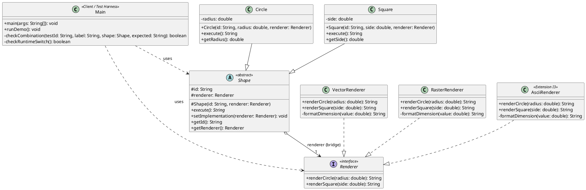

# Assignment 3: Bridge Pattern

**Course:** ShP-2216 Software Design Patterns  
**Instructor:** Yerassyl Bekenov  
**Institution:** Astana IT University | School of Software Engineering  
**Student:** Dias Tursynbay  
**Group:** SE-2537  
**Topic:** Option A (Drawing: Shapes & Renderers)  
**Language & Runtime:** Java (JDK 17) | Pure JDK classes only  
**Repository URL:** https://github.com/HumbleCherry10/SDP-assignment3.git  
**Base Commit Hash:** `b6114aa0596eded09def95ad021216b06a4b263c`  

---

## 1. Project Overview & Architectural Role Map

This project implements the **Bridge Pattern** (GoF) in Java 17 to decouple two independently varying class hierarchies:
1. **Abstraction Hierarchy:** Geometric domain entities (`Shape`, `Circle`, `Square`).
2. **Implementor Hierarchy:** Low-level rendering subsystems (`Renderer`, `VectorRenderer`, `RasterRenderer`, `AsciiRenderer`).

By connecting the two hierarchies via object composition rather than inheritance, any shape can be rendered using any renderer without combinatorial class explosion ($N \times M$ subclasses reduced to $N + M$ classes). Implementations can also be swapped dynamically at runtime on the same object instance.

### Role Mapping Table

| Role | Concept / Type | Class Name | Source Path | Description |
| :--- | :--- | :--- | :--- | :--- |
| **Abstraction** | Abstract Base Class | `Shape` | [`src/bridge/abstraction/Shape.java`](file:///c:/Users/Dias/Desktop/SDP-assignment3/src/bridge/abstraction/Shape.java) | Maintains domain ID and encapsulates `Renderer` interface reference. |
| **A1** | Refined Abstraction 1 | `Circle` | [`src/bridge/abstraction/Circle.java`](file:///c:/Users/Dias/Desktop/SDP-assignment3/src/bridge/abstraction/Circle.java) | Encapsulates circle domain state (`radius=2.0`); delegates to `renderCircle`. |
| **A2** | Refined Abstraction 2 | `Square` | [`src/bridge/abstraction/Square.java`](file:///c:/Users/Dias/Desktop/SDP-assignment3/src/bridge/abstraction/Square.java) | Encapsulates square domain state (`side=3.0`); delegates to `renderSquare`. |
| **Implementor** | Bridge Interface | `Renderer` | [`src/bridge/implementor/Renderer.java`](file:///c:/Users/Dias/Desktop/SDP-assignment3/src/bridge/implementor/Renderer.java) | Defines primitive rendering operations (`renderCircle`, `renderSquare`). |
| **I1** | Concrete Implementor 1 | `VectorRenderer` | [`src/bridge/implementor/VectorRenderer.java`](file:///c:/Users/Dias/Desktop/SDP-assignment3/src/bridge/implementor/VectorRenderer.java) | Simulates high-precision mathematical vector rendering. |
| **I2** | Concrete Implementor 2 | `RasterRenderer` | [`src/bridge/implementor/RasterRenderer.java`](file:///c:/Users/Dias/Desktop/SDP-assignment3/src/bridge/implementor/RasterRenderer.java) | Simulates discrete pixel grid bitmap rendering. |
| **I3** | Concrete Implementor 3 (Extension) | `AsciiRenderer` | [`src/bridge/implementor/AsciiRenderer.java`](file:///c:/Users/Dias/Desktop/SDP-assignment3/src/bridge/implementor/AsciiRenderer.java) | Simulates terminal character glyph rendering (added independently). |
| **Client** | Application / Test Harness | `Main` | [`src/Main.java`](file:///c:/Users/Dias/Desktop/SDP-assignment3/src/Main.java) | Executes and verifies automated checks T1–T7. |

### Key Code Navigation Pointers
- **Bridge field:** `protected Renderer renderer;` in [`Shape.java`](file:///c:/Users/Dias/Desktop/SDP-assignment3/src/bridge/abstraction/Shape.java#L11).
- **Domain execution:** `public abstract String execute();` in [`Shape.java`](file:///c:/Users/Dias/Desktop/SDP-assignment3/src/bridge/abstraction/Shape.java#L33), implemented in [`Circle.java`](file:///c:/Users/Dias/Desktop/SDP-assignment3/src/bridge/abstraction/Circle.java#L38) and [`Square.java`](file:///c:/Users/Dias/Desktop/SDP-assignment3/src/bridge/abstraction/Square.java#L38).
- **Runtime switching method:** `public void setImplementation(Renderer renderer)` in [`Shape.java`](file:///c:/Users/Dias/Desktop/SDP-assignment3/src/bridge/abstraction/Shape.java#L42).
- **T5 runtime switch proof:** `checkRuntimeSwitch()` in [`Main.java`](file:///c:/Users/Dias/Desktop/SDP-assignment3/src/Main.java#L104).

---

## 2. Standard Build & Run Commands

The project requires only a standard JDK 17 installation and contains zero external dependencies.

```bash
# 1. Compile all source files using JDK 17
javac --release 17 -encoding UTF-8 -d out "@sources.txt"

# 2. Run the automated demonstration suite
java -cp out Main --demo
```

---

## 3. Demonstration Checks (T1–T7) & Expected Outcomes

| Check | Target Setup | Participating Classes | Expected Result / State Evidence |
| :---: | :--- | :--- | :--- |
| **T1** | A1 with I1 | `Circle` + `VectorRenderer` | `result=VECTOR circle radius=2` |
| **T2** | A1 with I2 | `Circle` + `RasterRenderer` | `result=RASTER circle radius=2` |
| **T3** | A2 with I1 | `Square` + `VectorRenderer` | `result=VECTOR square side=3` |
| **T4** | A2 with I2 | `Square` + `RasterRenderer` | `result=RASTER square side=3` |
| **T5** | Runtime Switch on single A1 instance | `Circle` (`VectorRenderer` $\to$ `RasterRenderer`) | `sameObject=true` (via `==`), `stateUnchanged=true` (`id` and `radius` intact)<br>`before=VECTOR circle radius=2 \| after=RASTER circle radius=2` |
| **T6** | A1 with new I3 | `Circle` + `AsciiRenderer` | `result=ASCII circle radius=2` |
| **T7** | A2 with new I3 | `Square` + `AsciiRenderer` | `result=ASCII square side=3` |

### Actual Demonstration Output
```text
T1 PASS | Circle + VectorRenderer | result=VECTOR circle radius=2
T2 PASS | Circle + RasterRenderer | result=RASTER circle radius=2
T3 PASS | Square + VectorRenderer | result=VECTOR square side=3
T4 PASS | Square + RasterRenderer | result=RASTER square side=3
T5 PASS | sameObject=true | stateUnchanged=true
 before=VECTOR circle radius=2 | after=RASTER circle radius=2
T6 PASS | Circle + AsciiRenderer | result=ASCII circle radius=2
T7 PASS | Square + AsciiRenderer | result=ASCII square side=3
SUMMARY: 7/7 PASS
```

---

## 4. Extension Verification & Diff

The extension step added `AsciiRenderer` (I3) and updated `Main.java` to test T6 and T7. The existing abstraction classes (`Shape`, `Circle`, `Square`), the `Renderer` interface, and initial implementors (`VectorRenderer`, `RasterRenderer`) remained **100% unchanged**.

To recreate the source diff against the base commit:
```bash
git diff b6114aa HEAD -- src > extension.diff
```

The diff strictly touches:
- `src/bridge/implementor/AsciiRenderer.java` (new file)
- `src/Main.java` (added T6 and T7 checks)

---

## 5. PlantUML Class Diagram Source



---

## 6. Defense Guide & Checkpoints (D1–D4)

### Minute 1: Demonstration Execution
Run `java -cp out Main --demo`. Explain that all 7 checks execute sequentially without interactive input, verify actual string output and object identity, and calculate `SUMMARY: 7/7 PASS`.

### Minute 2: Roles & Delegation (D1)
- **Two Hierarchies:** Show `Shape` (abstraction representing what to draw) and `Renderer` (implementor representing how to draw).
- **Decoupling via Composition:** Point to `protected Renderer renderer;` in `Shape.java`. The abstraction delegates the rendering call: `Circle.execute()` invokes `renderer.renderCircle(radius)`.
- **No Concrete Coupling:** `Circle` and `Square` have no knowledge of `VectorRenderer`, `RasterRenderer`, or `AsciiRenderer`.

### Minute 3: Runtime Switch & Object Identity (D2)
- Point to `checkRuntimeSwitch()` in `Main.java`.
- Explain `shape.setImplementation(new RasterRenderer());`.
- **Identity Proof:** `refBefore == refAfter` evaluates to `true`, verifying that memory reference is identical (no new shape object was allocated).
- **State Preservation:** Shape `id` (`"C-01"`) and domain parameter `radius` (`2.0`) are immutable and preserved, while the output changes from `VECTOR circle radius=2` to `RASTER circle radius=2`.

### Minute 4: Independent Extension & Adapter Comparison (D3)
- Show `extension.diff`: Adding `AsciiRenderer` required zero edits to `Shape`, `Circle`, `Square`, `Renderer`, `VectorRenderer`, or `RasterRenderer` (Open/Closed Principle).
- **Bridge vs. Adapter:**
  - **Bridge (Structural):** Designed upfront to let abstraction and implementation vary independently via composition.
  - **Adapter (Structural):** Designed retroactively to make incompatible, existing interfaces collaborate without altering existing code.

### Minute 5: Code Walkthrough & Predicted Changes (D4)
- Explain `formatDimension(double value)` in renderers or validation in `Shape` constructors.
- **Predicting Changes:**
  - *If radius changed to 5:* Output will cleanly become `VECTOR circle radius=5`.
  - *If a new shape `Triangle` is added:* Create `Triangle extends Shape` and add `renderTriangle` or reuse low-level rendering without affecting existing shapes.
